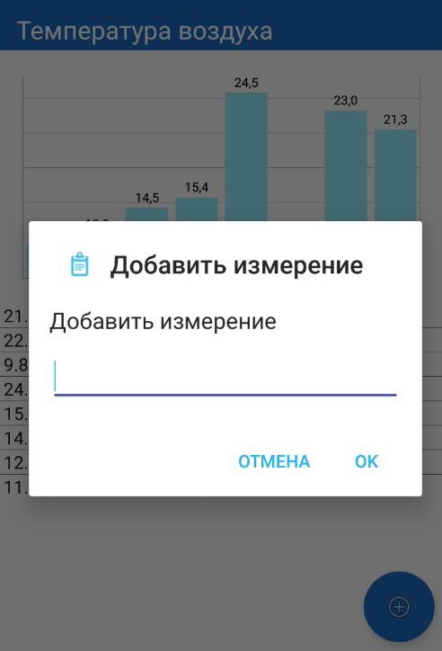

Field App Native (Java edition)

Идея программного обеспечения заключается в реализации простейшего способа ручной передачи данных различных величин и визуализации их на сервере в табличной форме и виде графиков.

The idea of the software is to implement the simplest way manual transmission of data of various values and their visualization on the server in tabular form and in the form of graphs.

Mobile application developed on pure Java with realmDb as storage and retrofit as API.

 
 
 
 
